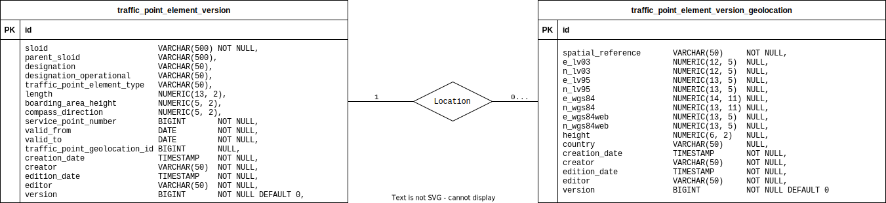
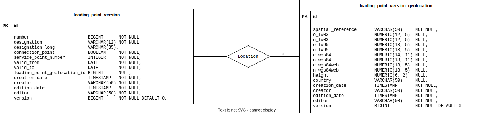

# DB Schema - Service Point Directory

## Service Points

Relations of ServicePoints are:
- A `ServicePoint` may have a location - in `ServicePointGeolocation`.
- A `ServicePoint` may have one or more categories. These are defined as the `Category` enum.

## Traffic Point Elements

Relations of TrafficPointElements are:
- A `TrafficPointElements` may have a location - in `TrafficPointElementGeolocation`.

## Loading Points

Relations of LoadingPoints are:
- A `LoadingPoint` may have a location - in `LoadingPointGeolocation`.

